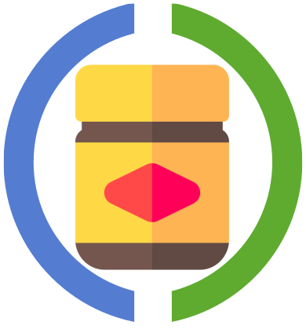

# Vegamite



An experiment with schema validation.

## Usage

Start a repl and use your Clay skillz.

## Getting the Schema

`vega-lite.v5.json` was obtained from [Vega Schema](https://github.com/vega/schema)

```
wget https://vega.github.io/schema/vega-lite/v5.json
```
